# Vue Components

Client Side는 `Vue.js`를 이용하여 구성하였습니다.

## Hierarchy

```{4,9,12,15,18,19}
VueApp
├─ SiteHeader.vue
├─ VueRouter
│  ├─ /news: News.vue 
│  │  ├─ NewsWrapper.vue
│  │  │   ├─ Headline.vue
│  │  │   └─ Article.vue 
│  │  └─ NewsDetail.vue
│  ├─ /music: Chart.vue
│  │  ├─ ChartCategory.vue 
│  │  ├─ VideoPlayer.vue 
│  │  └─ ChartArticle.vue
│  ├─ /popular: Popular.vue
│  │  ├─ VideoPlayer.vue
│  │  └─ VideoArticle.vue
│  ├─ /bookmark: Bookmark.vue
│  │  ├─ VideoPlayer.vue 
│  │  └─ VideoArticle.vue
│  ├─ /sign-in: Login.vue
│  └─ /sign-up: Join.vue
├─ SiteFooter.vue
└─ Modal.vue
```

## App.vue

@startuml
rectangle "App\n" {
  component SiteHeader
  component VueRouter
  component SiteFooter
  component Modal
}
SiteHeader -[hidden] VueRouter
VueRouter -[hidden] SiteFooter
SiteFooter -[hidden] Modal
@enduml

- SiteHeader\
  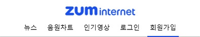

- [VueRouter](#vuerouter)

- SiteFooter\
  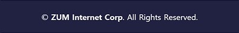

- Modal\
  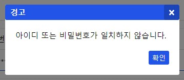


## VueRouter

@startuml
skinparam card {
   BorderColor transparent
   BackgroundColor transparent
}
agent VueRouter
($route.path) as path
card "" as News
card "" as SignIn
card "" as Music
card "" as SignUp
card "" as Popular
card "" as Bookmark

VueRouter <<-- path
path <<--- "/\n/news\n" News
path <<--- "/music\n" Music
path <<--- "/popular\n" Popular
path <<----- "/sign-in\n" SignIn
path <<----- "/sign-up\n" SignUp
path <<----- "/bookmark\n" Bookmark
@enduml

## News.vue
@startuml
rectangle News {
  rectangle NewsHeadline
  collections NewsArticle
  rectangle Detail
}
NewsHeadline -[hidden] NewsArticle
NewsArticle -[hidden] Detail
@enduml

- NewsHeadline\
  

- NewsArticle\
  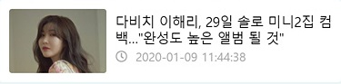

- Detail\
  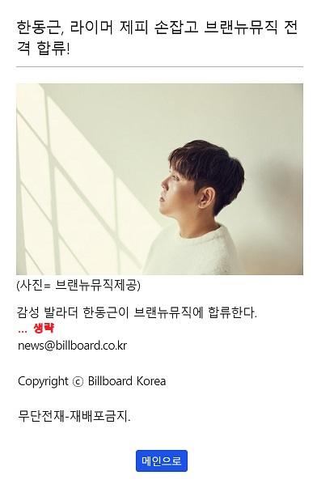

## Chart | Popular | Bookmark.vue
@startuml
rectangle Chart {
  rectangle ChartCategory
  rectangle VideoPlayer as player1
  collections ChartArticle
}
rectangle Popular {
  rectangle VideoPlayer as player2
  collections "VideoArticle\n---\n\
  title\n\
  thumbnail\n\
  viewCount\n\
  likeCount\n\
  popularPoint" as article1
}
rectangle Bookmark {
  rectangle VideoPlayer as player3
  collections "VideoArticle\n---\n\
  title\n\
  thumbnail" as article2
}
ChartCategory --[hidden] player2
Popular -[hidden] Bookmark
player1 -[hidden] ChartArticle
Popular -[hidden] Bookmark
player2 -[hidden] article1
player3 -[hidden] article2
@enduml

- ChartCategory\
  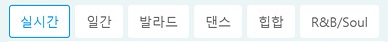

- VideoPlayer\
  

- ChartArticle\
  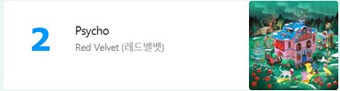

- Popular - VideoArticle\
  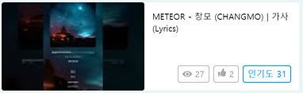

- Bookmark - VideoArticle\
  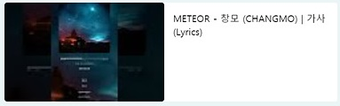

## Login | Join.vue

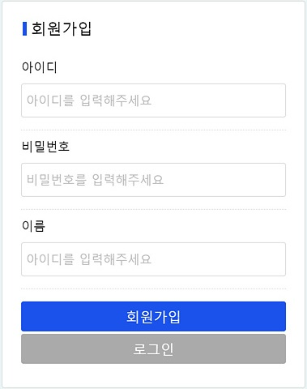
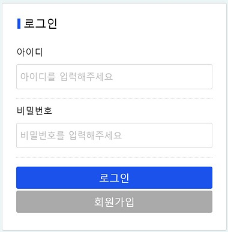

다른 컴포넌트를 사용하지 않았습니다.

## Summary

@startuml
rectangle "App\n" {
  component SiteHeader [
   **SiteHeader**
  ]
  component VueRouter [
   **VueRouter**
  ]
  component SiteFooter [
   **SiteFooter**
  ]
  component Modal [
   **Modal**
  ]
  
  ($route.path) as path
  component "/news: News" as News {
    rectangle NewsHeadline
    collections NewsArticle
    rectangle Detail
    NewsHeadline -[hidden] NewsArticle
    NewsArticle -[hidden] Detail
  }
  component "/chart: Chart" as Chart {
    rectangle ChartCategory
    rectangle VideoPlayer as player1
    collections ChartArticle
  }
  component "/popular: Popular" as Popular {
    rectangle VideoPlayer as player2
    collections "VideoArticle\n---\n\
    title\n\
    thumbnail\n\
    viewCount\n\
    likeCount\n\
    popularPoint" as article1
  }
  component "/bookmark: Bookmark" as Bookmark {
    rectangle VideoPlayer as player3
    collections "VideoArticle\n---\n\
    title\n\
    thumbnail" as article2
  }
  component Login [
    **/sign-in: Login**
  ]
  component Join [
    **/sign-up: Join**
  ]
}
SiteHeader --[hidden] VueRouter
VueRouter --[hidden] SiteFooter
SiteFooter --[hidden] Modal
VueRouter <<- path

path - News
path -- Chart
path -- Popular
path -- Bookmark
path -- Login
path -- Join

News --[hidden] Chart
Chart --[hidden] Popular
Popular --[hidden] Bookmark
Bookmark --[hidden] Join
Join --[hidden] Login

ChartCategory -[hidden] player1
player1 -[hidden] ChartArticle
Popular -[hidden] Bookmark
player2 -[hidden] article1
player3 -[hidden] article2

@enduml