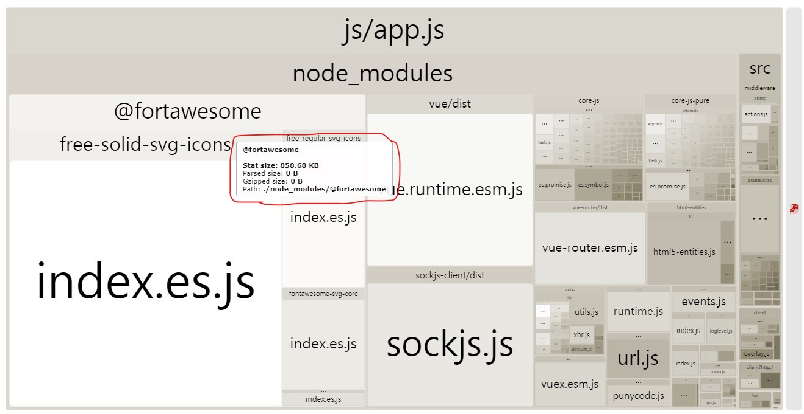
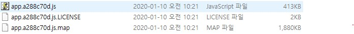

# 분석 및 최적화


vue-cli에 포함된 vue-loader는 `*.vue`를 포함해 webpack을 기반으로 프로젝트를 구성할 수 있도록 해주는 도구입니다. 그리고 webpack으로 구성된 프로젝트를 build할 때 다양한 이슈가 발생할 수 있습니다.

그러한 이슈들을 해결할 때 사용한 분석 및 최적화 도구와 방법에 대해 소개합니다.

## 1. analyzer

analyzer는 `webpack-bundle-analyzer`를 사용했습니다.

### install 
``` sh
yarn add -D webpack-bundle-analyzer
```

### 적용

`vue-cli`로 만든 프로젝트는 `vue.config.js`를 통해서 `webpack` 설정을 `override`할 수 있습니다.

**vue.cofig.js**

``` js{1,6,7,8}
const BundleAnalyzerPlugin = require('webpack-bundle-analyzer').BundleAnalyzerPlugin;
module.exports = {
  // 앞 내용 생략
  configureWebpack: config => {
    // NODE_ENV의 값이 analyze일 때 Analyzer를 작동시킵니다.
    if (process.env.NODE_ENV === 'analyze') {
      config.plugins = [new BundleAnalyzerPlugin()];
    }
  },
}
```

그리고 `package.json`에 analyze 시작을 위한 `npm script`를 작성해야 합니다.

``` json{7}
{
  // 앞 내용 생략
  "scripts": {
    "serve": "vue-cli-service serve",
    "build": "vue-cli-service build",
    "lint": "vue-cli-service lint",
    "analyze": "cross-env NODE_ENV=analyze vue-cli-service serve"
  },
  // 뒷 내용 생략
}
```

그리고 실행해주면 프로젝트에서 작동중인 코드들의 용량을 확인할 수 있습니다.



box의 size가 클 수록 용량이 `상대적으로 큰 것`입니다.

그리고 여기서 문제를 확인할 수 있습니다. icon 사용을 위해 fontawsome package를 설치했는데, 생각보다 용량이 너무 컸습니다.


그래서 babel의 기능을 이용하여 fontasome pacakge 중 필요한 것만 포함 시키도록 하였습니다.

**.babelrc**

``` json
{
  "plugins": [
    ["transform-imports", {
      "@fortawesome/free-solid-svg-icons": {
        "transform": "@fortawesome/free-solid-svg-icons/${member}",
        "skipDefaultConversion": true
      },
      "@fortawesome/free-regular-svg-icons": {
        "transform": "@fortawesome/free-regular-svg-icons/${member}",
        "skipDefaultConversion": true
      }
    }]
  ]
}
```
 
이렇게 하면 지정한 것들만 가져오게 됩니다.

다시 analyzer를 실행하여 확인해본 결과


`860kb에서 100kb` 정도로 줄어든 것을 확인할 수 있었습니다.

## 2. Code Splitting

Vue.js는 SPA(Single Page Application)을 만드는 도구이며
Code Splitting은 SPA의 성능을 향상시키는 방법입니다.
SPA는 초기 실행시 모든 자원(css, js, ...)을 한 번에 불러옵니다.



이럴 경우 **사이트 로딩이 매우 느려질 수 있습니다.**

그런데 `Code Splitting`을 활용하게 되면 **필요한 시점에 자원을 불러와 사용**합니다.

::: tip Lazy Loading
`Dynamic Import` + `webpackChunkName`을 사용하면 Lazy Loading이 가능합니다.
- Dynamic Import는 `const moduleName = () => import('path')` 형태로 사용할 수 있습니다.
- path 앞에 할 때 prefix로 `/*webpackChunkName: name*/`을 붙이면 리소스를 분리하고 묶을 수 있습니다.
- `index.js`를 이용하면 쉽게 관리할 수 있습니다.
:::

**실제 사용 예는 다음과 같습니다.**  

### 폴더 구조
```{4,12,15}
client/src
├─ components
│   ├─ video
│   │   ├─ index.js
│   │   ├─ Article.vue
│   │   ├─ List.vue
│   │   ├─ Meta.vue
│   │   ├─ Player.vue
│   │   └─ Controls.vue
│   └─ ...
├─ views
│   ├─ index.js
│   ├─ Popular.vue
│   └─ ...
├─ middleware/router/index.js
└─ ...
```
`**/index.js`를 이용하여 import/export를 관리합니다.


### index.js를 사용하면 좋은 점 

다음과 같이 `index.js를 생략하여 import` 할 수 있습니다.

``` js
import { VideoPlayer, VideoControls } from 'components/video/index.js'
import { NewsArticle, NewsDetail } from 'components/news/index.js'
import { SiteHeader, SiteFooter } from 'components/common/index.js'
import { Alert } from 'components/modal/index.js'

// index.js를 생략할 수 있습니다.
import { VideoPlayer, VideoControls } from 'components/video'
import { NewsArticle, NewsDetail } from 'components/news'
import { SiteHeader, SiteFooter } from 'components/common'
import { Alert } from 'components/modal'
```
  
### Code Splitting 적용

``` js
/* client/src/views/index.js */
export const News = () => import(/* webpackChunkName: "views" */'./News.vue');
export const Chart = () => import(/* webpackChunkName: "views" */'./Chart.vue');
export const Login = () => import(/* webpackChunkName: "views" */'./Login.vue');
export const Join = () => import(/* webpackChunkName: "views" */'./Join.vue');
export const Popular = () => import(/* webpackChunkName: "views" */'./Popular.vue');
export const Bookmark = () => import(/* webpackChunkName: "views" */'./Bookmark.vue');

/* client/src/components/video/index.js */
export const VideoList = () => import(/* webpackChunkName: "chart" */'./List.vue');
export const VideoPlayer = () => import(/* webpackChunkName: "chart" */'./Player.vue');
export const VideoControls = () => import(/* webpackChunkName: "chart" */'./Controls.vue');
export const VideoMeta = () => import(/* webpackChunkName: "chart" */'./Meta.vue');
export const VideoArticle = () => import(/* webpackChunkName: "chart" */'./Article.vue');

/* 나머지 생략 */
```

**client/src/middleware/router/index.js** 
``` js
/* 앞 내용 생략 */
import { News, Chart, Login, Join, Popular, Bookmark } from '@/views';
const routes = [
  { path: '/', component: News, alias: '/news' },
  { path: '/chart', component: Chart },
  { path: '/sign-in', component: Login },
  { path: '/sign-up', component: Join },
  { path: '/popular', component: Popular },
  { path: '/bookmark', component: Bookmark },
];
/* 뒷 내용 생략 */
```
**client/src/views/Chart.vue** 
``` html
<template><!-- 생략 --></template>
<script>
// 앞 생략
import { Flicking } from '@egjs/vue-flicking';
import { ChartArticle } from '@/components/chart';
import { VideoPlayer } from '@/components/video';
import { Spinner } from '@/components/common';
const components = { ChartArticle, VideoPlayer, Flicking, Spinner };
// 뒤 생략
</script>
```

이렇게 작성 후 `build` 하면 다음과 같이 분리됩니다.


`app` `chart` `modal` `news` `template` `views` 등으로 쪼개진 것을 확인할 수 있습니다.