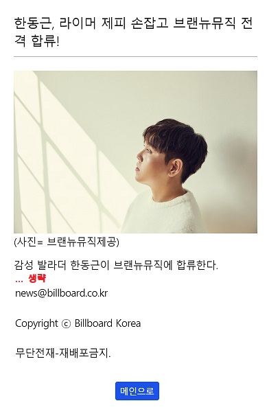
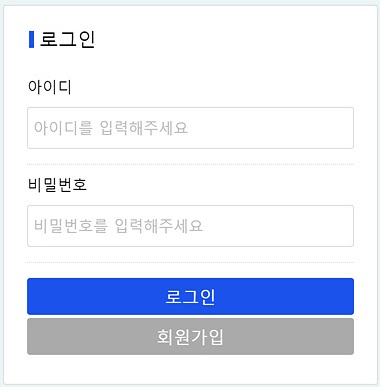

# 클라이언트 사이드

Client Side는 `Vue.js`를 이용하여 구성하였습니다.

## 1. Vue Component Structure

```{4,9,12,15,18,19}
VueApp
├─ SiteHeader.vue
├─ VueRouter
│  ├─ /news: News.vue 
│  │  ├─ NewsWrapper.vue
│  │  │   ├─ Headline.vue
│  │  │   └─ Article.vue 
│  │  └─ NewsDetail.vue
│  ├─ /music: Chart.vue
│  │  ├─ ChartCategory.vue 
│  │  ├─ VideoPlayer.vue 
│  │  └─ ChartArticle.vue
│  ├─ /popular: Popular.vue
│  │  ├─ VideoPlayer.vue
│  │  └─ VideoArticle.vue
│  ├─ /bookmark: Bookmark.vue
│  │  ├─ VideoPlayer.vue 
│  │  └─ VideoArticle.vue
│  ├─ /sign-in: Login.vue
│  └─ /sign-up: Join.vue
├─ SiteFooter.vue
└─ Modal.vue
```

### App.vue

@startuml
rectangle "App\n" {
  rectangle SiteHeader
  rectangle VueRouter {
    rectangle News
    rectangle Chart
    rectangle Popular
    rectangle Login
    rectangle Join
    rectangle Bookmark
  }
  rectangle SiteFooter
  rectangle Modal
}
SiteHeader --[hidden] VueRouter
VueRouter --[hidden] SiteFooter
SiteFooter -[hidden] Modal
News -[hidden] Chart
Chart -[hidden] Popular
Popular -[hidden] Login
Login -[hidden] Join
Join -[hidden] Bookmark
@enduml

- SiteHeader\

- [VueRouter](#vuerouter)

- SiteFooter\

- Modal\


### VueRouter

@startuml
skinparam card {
   BorderColor transparent
   BackgroundColor transparent
}
agent VueRouter
card "" as News
card "" as SignIn
card "" as Music
card "" as SignUp
card "" as Popular
card "" as Bookmark

VueRouter --->> "/\n/news\n" News
VueRouter --->> "/music\n" Music
VueRouter --->> "/popular\n" Popular
VueRouter ----->> "/sign-in\n" SignIn
VueRouter ----->> "/sign-up\n" SignUp
VueRouter ----->> "/bookmark\n" Bookmark
@enduml

### News.vue
@startuml
rectangle News {
  rectangle NewsHeadline
  collections NewsArticle
  rectangle Detail
  component NewsWrapper [
    <b>NewsWrapper
    news_title <<require>>
    news_thumbnail <<require>>
    reg_date
  ]
}
NewsHeadline -[hidden] NewsArticle
NewsArticle -[hidden] Detail
NewsHeadline --|> NewsWrapper
NewsArticle --|> NewsWrapper
@enduml

- NewsHeadline\
  

- NewsArticle\
  

- Detail\
  

### Chart | Popular | Bookmark.vue
@startuml
rectangle Chart {
  rectangle ChartCategory
  rectangle VideoPlayer as player1
  collections ChartArticle
}
rectangle Popular {
  rectangle VideoPlayer as player2
  collections "VideoArticle\n---\n\
  title\n\
  thumbnail\n\
  viewCount\n\
  likeCount\n\
  popularPoint" as article1
}
rectangle Bookmark {
  rectangle VideoPlayer as player3
  collections "VideoArticle\n---\n\
  title\n\
  thumbnail" as article2
}
ChartCategory --[hidden] player2
Popular -[hidden] Bookmark
player1 -[hidden] ChartArticle
Popular -[hidden] Bookmark
player2 -[hidden] article1
player3 -[hidden] article2 
@enduml

- ChartCategory\
  

- VideoPlayer\
  

- ChartArticle\
  

- Popular - VideoArticle\
  

- Bookmark - VideoArticle\
  

### Login | Join.vue




다른 컴포넌트를 사용하지 않았습니다.

