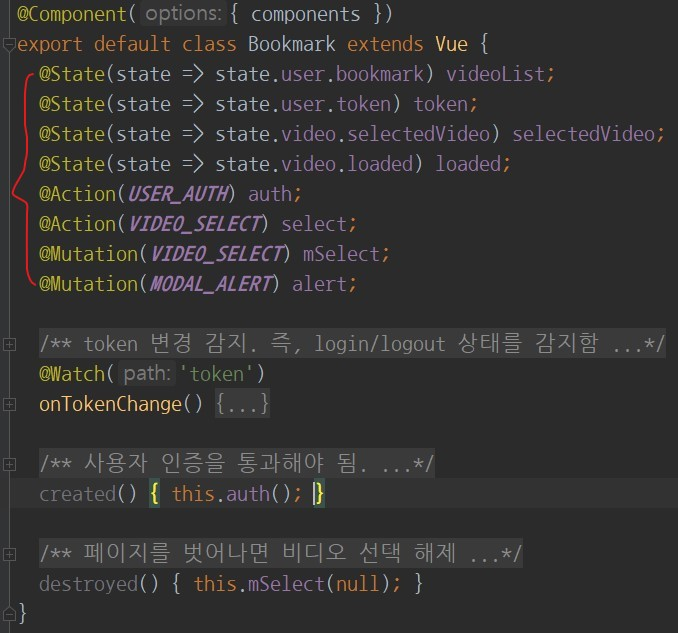

# Vue Store

vuex는 vue.js에서 제공하는 **중앙집중식 상태 관리 라이브러리**입니다.

## Structure

module화 하여 사용하였습니다.

```{4}
./middleware/store
  ├─ index.js
  ├─ mutations-type.js
  └─ modal|music|news|user|video
       ├─ index.js 
       ├─ actions.js 
       ├─ mutations.js 
       └─ state.js 
```

@startuml
rectangle "VueStore" {
  card mutations
  card actions
  card state
  card modules #faf
  card "mutations-type" as type #faa
  rectangle "**modal**\n---\n\
  state\n mutations\n actions" as modal
  rectangle "**music**\n---\n\
  state\n mutations\n actions" as music
  rectangle "**news**\n---\n\
  state\n mutations\n actions" as news
  rectangle "**user**\n---\n\
  state\n mutations\n actions" as user
  rectangle "**video**\n---\n\
  state\n mutations\n actions" as video
}
state -[hidden] mutations
mutations -[hidden] actions
actions -[hidden] modules
modules <<-- modal
modules <<-- music
modules <<-- news
modules <<-- user
modules <<-- video
type -up->> video
type -up->> modal
type -up->> music
type -up->> news
type -up->> user
@enduml

이렇게 사용하면 `state`만 `namespace`로 분리됩니다.

그래서 `mutations` `actions` 에 사용될 method name은 **mutations-type.js**을 통하여 관리합니다.

```js
// mutations-type.js : mutations 혹은 actions 에 사용될 상수를 정의합니다
export const VIDEO_FETCH = 'video/fetch'; // 비디오 가져오기
export const VIDEO_SELECT = 'video/select'; // 비디오 선택
export const VIDEO_VIEW = 'video/view'; // 비디오 조회수 증가
export const VIDEO_LIKE = 'video/like'; // 비디오 좋아요 토글
export const VIDEO_POPULAR_FETCH = 'video/popularFetch'; // 인기영상 가져오기
export const VIDEO_BOOKMARK = 'video/bookmark'; // 즐겨찾기 가져오기
export const VIDEO_LOADING = 'video/loading'; // 비디오 로딩 완료 여부
// ... 생략
``` 

그 다음 `component`에 필요한 `state` `mutations` `actions` 만 `mapping` 하여 사용합니다.



## Logic

Vuex의 로직은 다음과 같습니다.

@startuml
collections "VueComponents\n---\n\
State map to **computed**\n\
Actions and Mutations map to **methods**" as components
(REST API) as server
rectangle Vuex {
  rectangle Actions
  rectangle Mutations
  rectangle State
}
components -right-> Mutations : Commit
components -right-> Actions  : Dispatch
components <-down- State : Render
Mutations <-up- Actions : Commit
Mutations -down-> State : Replace
Actions o-right-o server : HttpCommunication
@enduml

- Component는 Actions와 Mutations을 사용할 수 있습니다.
- Actions는 Server(혹은 API)와 통신할 수 있습니다.
- State는 오직 Mutations을 통해서만 수정할 수 있습니다.
- Actions이 받아온 데이터를 Mutations에 넘깁니다.
- State가 수정되면 Component에 반영되어 렌더링됩니다.
