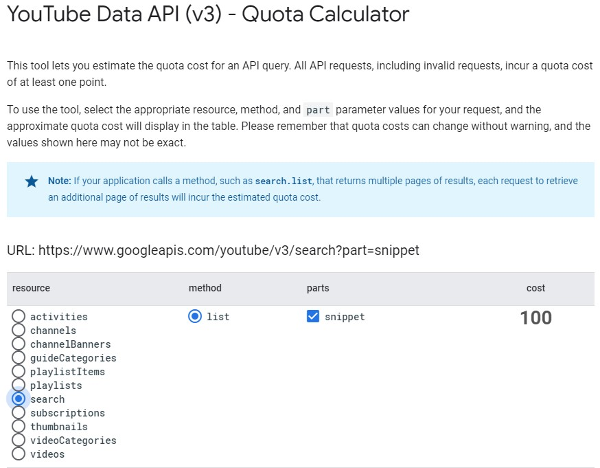
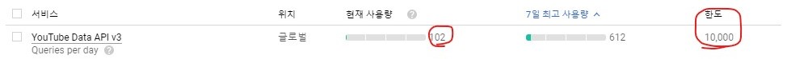
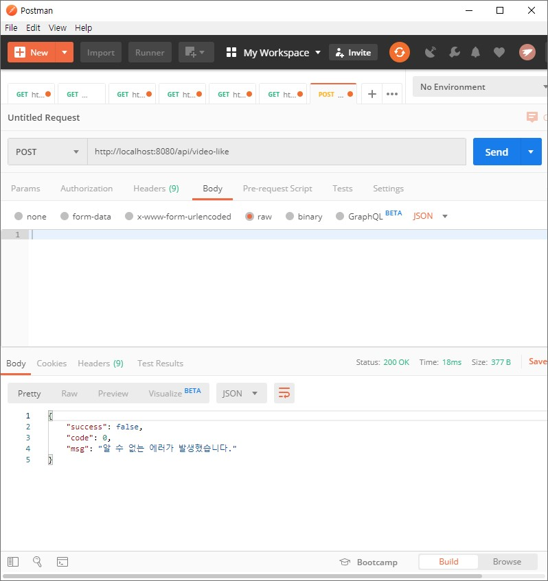
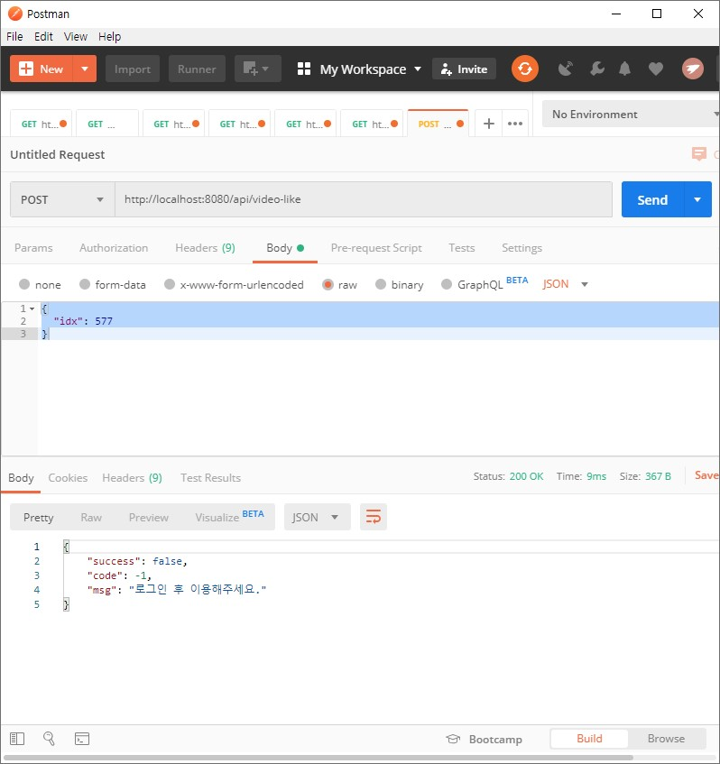
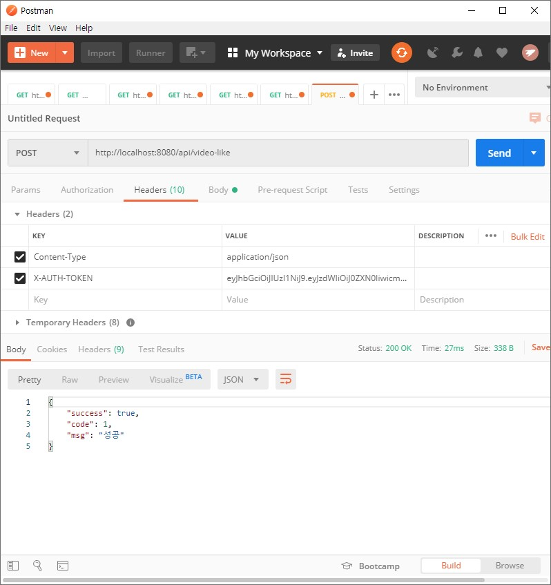

# 서버 사이드

## 1. Crawling

`SBS K-POP 뉴스` `빌보드코리아 뉴스` `멜론 차트` 등의 사이트를 크롤링 하는 과정에 대해 소개합니다.

### Jsoup
 
Crawling은 Jsoup을 활용했습니다. `Jsoup`은 **java로 만들어지는 HTML Parser**입니다.

``` java
Document doc = Jsoup.connect(url).userAgent(agent).get();
```

이렇게 URL에 해당하는 DOM을 Parsing할 수 있으며, **interface가 jQuery와 매우 유사합니다.**

### Flow Chart

@startuml
collections RestController
collections Service
collections Crawler
database WebSite

RestController -> Service : 정보 요청
Service -> Crawler : 정보 검색
Crawler -> WebSite : Request by **Jsoup**
Crawler <- WebSite : Response **text/html**
note over Crawler : - DOM Parsing\n- 결과 매핑
Service <- Crawler : 매핑된 결과 반환
note over Service : Caching 
RestController <- Service : 정보 반환
RestController -> Service : 정보 **재요청**
note right: cache data
RestController <- Service : **캐시**에서 반환
@enduml

Crawling한 Data는 `Caching` 하여 재사용하여 `1분 동안 저장`합니다.

Caching 후 1분 동안 요청이 오면 Cache에 저장된 data를 반환하고, 그 이후에는 다시 Jsoup을 통하여 크롤링을 수행합니다.

## 2. Youtube Search

크롤링 해온 **음원**에 대해 **Youtube에 검색해서 동영상을 가져오는 과정**에 대해 소개합니다.

### API Request Cost 

`Youtube Data API`를 통하여 Youtube에 있는 `동영상` `채널` `리소스` 등에 접근할 수 있습니다.

그런데 Youtube Data API는 Youtube Service의 자원을 사용하기 때문에, 요청에 대한 제한이 있습니다.

**하루에 `10000`의 할당량을 사용할 수 있으며, Request 종류별로 할당량에 대한 cost가 다릅니다.** 

공식 문서에서 요청에 대한 cost를 확인해볼 수 있는데, 정확한 수치가 아니라 `근삿값`입니다.



이렇듯 `Search` 요청은 기본적으로 `100` 이상의 Cost를 지불해야합니다.



`한 개의 Search 요청`을 보낸 후 API 관리자에서 확인해본 결과, 실제로 `102`의 Cost를 지불합니다. 한도가 10000 이므로, `하루에 98회의 Search 요청`을 보낼 수 있습니다.

### Youtube API Client Package

Youtube는 API를 Client에서 사용하기 쉽게 Client Package를 제공합니다.

``` java
import com.google.api.client.http.HttpRequest;
import com.google.api.client.http.HttpRequestInitializer;
import com.google.api.client.http.HttpTransport;
import com.google.api.client.http.javanet.NetHttpTransport;
import com.google.api.client.json.JsonFactory;
import com.google.api.client.json.jackson2.JacksonFactory;
import com.google.api.services.youtube.YouTube;
import com.google.api.services.youtube.model.SearchResultSnippet;

// { NetHttpTransprot, JacksonFactory } --> 구글에서 제공하는 Client API
// NetHttpTransport: java.net 패키지 기반의 Thread-safe http low-level Transport
// JacksonFactory: Jackson2 기반의 low-level JSON library
private HttpTransport HTTP_TRANSPORT = new NetHttpTransport();
private JsonFactory JSON_FACTORY = new JacksonFactory();

// API 사용에 필요한 Instance 생성
YouTube youtube = new YouTube.Builder(HTTP_TRANSPORT, JSON_FACTORY, new HttpRequestInitializer() {
  public void initialize(HttpRequest request) throws IOException { }
}).setApplicationName("youtube-cmdline-search-sample").build();
```

그리고 Snippet에서 필요한 것들만 선택하여 가져오면 됩니다.

``` java
search
  .setKey(API_KEY) // 검색에 사용할 API KEY
  .setQ(searchQuery) // 검색어. 제목+가수 형태의 문자열을 넘김
  .setType("video") // 기본값: chnnel,playlist,video. 현재 필요한 것은 video
  .setMaxResults(1) // 검색된 목록에서 가져올 데이터의 수
  .setFields("items(id/videoId,snippet(title,thumbnails/default/url))") // 결과로 가져올 필드
  .execute() // Search 실행 후 결과를 Video List에 Mapping
  .getItems()
  .forEach(v -> {
    SearchResultSnippet snippet = v.getSnippet();
    result.add(
      Video.builder()
        .title(snippet.getTitle())
        .videoId(v.getId().getVideoId())
        .thumbnail(snippet.getThumbnails().getDefault().getUrl())
        .searchTitle(searchQuery)
        .build()
    );
  });
```

### Search Result Save

`VideoService`의 일부 코드입니다.

``` java
/*
 * 검색어(제목+가수) 기반으로 Video 정보를 가져옴
 * @param q : 검색어(제목+가수)
 * @return : Video Entity
 * @throws VideoNotFoundException : 동영상을 가져오는 과정에 오류가 발생했을 때 예외 처리
 */
@Cacheable(cacheNames = "VideoCache", key="#q")
public Video getBySearch (String q) throws VideoNotFoundException {
  // 일단 DB에 video가 있는지 탐색
  Video video = Optional.ofNullable(videoRepository.findBySearchTitle(q)).orElseGet(() -> {
    // DB에 없다면 Youtube Search
    Video v = Optional.ofNullable(youtubeSearch.execute(q))
                      .orElseThrow(VideoNotFoundException::new);
    videoRepository.save(v);
    return v;
  });
  // 탐색해온 Video 정보 반환
  return video;
}
```

앞서 언급했듯이 **API 요청에는 cost가 필요**합니다.
그래서 중복 요청을 방지하기위해 이미 **결과로 가져온 데이터는 DB에 저장하고, Caching 처리** 합니다.
따라서 API 요청을 하기 위해선 일단 cache와 db를 거쳐야 합니다. 

### Flow Chart

Youtube Search를 위한 과정은 다음과 같습니다.

@startuml
participant VideoController
participant Service
participant YoutubeSearch
database Youtube
 
VideoController -> Service : 동영상 정보 요청
Service -> YoutubeSearch : 검색어 전달
note over YoutubeSearch : - Youtube 연결\n- 요청 정보 작성
YoutubeSearch -> Youtube : 검색
YoutubeSearch <- Youtube : 검색 결과 반환
note over YoutubeSearch : 검색 결과 매핑 
Service <- YoutubeSearch : 매핑된 정보 전달 
note over Service : - DB에 저장\n- Caching 
VideoController <- Service : 동영상 정보 반환  
VideoController -> Service : 동영상 정보 **재요청**
note right: - cache\n- DB
VideoController <- Service : **캐시**에서 반환
@enduml

음원의 제목을 통해서 Youtube에 검색합니다. 검색 후 DB에 결과를 저장하고, 캐싱까지 합니다.

그래서 동영상 정보를 재요청시 Cache나 DB에서 가져오게 됩니다. 

## 3. Authorization

회원가입 후 로그인을 하면 다음과같은 과정으로 `JWT(Json Web Token)`을 발행합니다.

``` java
/**
* 토큰 생성
* @param userId : user의 id
* @param roles : user의 역할. 현재는 ROLE_USER 만 존재
* @return 토큰 값 반환
*/
public String createToken(String userId, List<String> roles) {
  Claims claims = Jwts.claims().setSubject(userId); // claim 생성
  claims.put("roles", roles); // role 지정
  Date now = new Date();
  return Jwts.builder()
          .setClaims(claims) // claim 지정
          .setIssuedAt(now) // 토큰 발행 일자 지정
          .setExpiration(new Date(now.getTime() + tokenValidMS)) // 유효 시간 지정
          .signWith(SignatureAlgorithm.HS256, secretKey) // 암호화 알고리즘, secret 값 지정
          .compact(); // 위의 내용을 압축 후 반환
}

```

@startuml
Browser -> UserController : request /api/sign-in
UserController -> UserService : ID/PW
note over UserService : ID/PW 검증
note over UserService : 회원 정보 fetch
UserController <- UserService : 회원 정보 전달
UserController -> JWTProvider : ID
note over JWTProvider : JWT 생성
UserController <- JWTProvider : JWT 전달
Browser <- UserController : response - 회원정보 + JWT
@enduml

## 4. Authentication

Authentication은 Spring Security의 Filter와 JWT를 이용합니다.

먼저 spring security에서 **filter를 정의**합니다.

``` java
/**
* http 요청에 대해 처리하는 내용을 정의함
* @param http
* @throws Exception
*/
@Override
protected void configure (HttpSecurity http) throws Exception {
http
  .httpBasic().disable() // spring-security에서 제공하는 /login 과 같은 페이지 비활성
  .csrf().disable() // Cross site request forgery 비활성
  .sessionManagement().sessionCreationPolicy(SessionCreationPolicy.STATELESS) // session을 stateless 형태로 관리
  .and()
     // jwt를 이용하는 filter 추가
    .addFilterBefore(new JwtAuthenticationFilter(jwtTokenProvider), UsernamePasswordAuthenticationFilter.class); // filter 사용
}
```

이렇게 모든 요청에 대해 `jwtAuthenticationFilter`를 통해 사전 검증을 합니다.

``` java
@Override
public void doFilter(
  ServletRequest request,
  ServletResponse response,
  FilterChain chain
) throws IOException, ServletException {
  // request의 header에 포함된 Token 정보를 가져온다.
  String token = jwtTokenProvider.resolveToken((HttpServletRequest) request);
  
  // token 정보가 존재할 때만 token을 검증
  if (token != null && jwtTokenProvider.validateToken(token)) {
    // token에서 값을 추출하여
    Authentication auth = jwtTokenProvider.getAuthentication(token);
    // context에 저장한다.
    SecurityContextHolder.getContext().setAuthentication(auth);
  }
  
  chain.doFilter(request, response);
}
```

이렇게 Request Header에 Token 정보가 있을 때만 Token 검증 후 Token에 담긴 Authentication을 Security Context에 저장합니다. 그리고 다음과 같이 사용됩니다.

``` java
/**
 * AuthenticationCheck
 * @return
 * @throws AuthException
 */
public String AuthenticationCheck () throws AuthException {
  // Security Context 에 저장한 authentication 정보 가져오기
  Authentication auth = SecurityContextHolder.getContext().getAuthentication();
  // Token 에서 가져온 User Id가 익명의 사용자일 경우 예외처리
  String userId = auth.getName();
  if (userId.equals("anonymousUser")) {
     throw new AuthException();
  }
  return userId;
}
```

즉, Security의 Authentication 정보는 기본 값이 항상 `anoymousUser`입니다. 이런식으로 User 권한이 필요할 때 Token 정보를 통해서 검증이 가능합니다.

@startuml
Browser -> SpringSecurity : Request
note over SpringSecurity : Filtering
note over SpringSecurity : JWT parsing
SpringSecurity -> VideoController : Filtered request
note over VideoController : SpringSecurityContext\nauthentication
Browser <- VideoController : 인증 실패시,\n에러코드 반환
VideoController -> VideoService : 인증 성공시,\nUser data
note over VideoService : data process
VideoController <- VideoService : Video data
Browser <- VideoController : Response
@enduml

## 5. Exception

예외는 `Optional`과 Spring의 `RestControllerAdvice`와 예외처리에 대한 Response를 만들었습니다.

`ExceptionAdvice.java`의 일부입니다.

``` java{13}
@Slf4j
@RequiredArgsConstructor
@RestControllerAdvice
public class ExceptionAdvice {
  private final ResponseService responseService;

  /**
   * User select 에 대한 response 예외 처리
   * @param request
   * @param e
   * @return USER_FAIL
   */
  @ExceptionHandler(UserIdNotFoundException.class)
  @ResponseStatus(HttpStatus.OK)
  protected CommonResult userIdNotFoundException(HttpServletRequest request, Exception e) {
    return responseService.failResult(CommonResponse.USER_FAIL);
  }
  // 나머지 생략
}
```

아래의 코드에서 예외가 발생하면 `ExceptionAdvice`에서 처리됩니다.

``` java{9}
/**
 * 유저 정보가 Null 이면 Exception 처리, 아니면 유저 정보 반환
 * @param userId : User의 login ID
 * @return
 * @throws UserIdNotFoundException : 유저 정보 탐색에 대한 실패 처리
 */
@Override
public User loadUserByUsername(String userId) throws UserIdNotFoundException {
  return Optional.ofNullable(get(userId)).orElseThrow(UserIdNotFoundException::new);
}
```

즉, ExceptionAdvice.java에 정의된 Exception 이 발생하면 ExceptionAdvice가 바로 관련 Response 데이터를 만들고 바로 브라우저에 return 합니다.

@startuml
Browser -> RESTAPI
note over RESTAPI : 예외 발생
RESTAPI -> ExceptionAdvice : Exception Handler
note over ExceptionAdvice : 예외에 대한 Response 생성
ExceptionAdvice -> Browser : \t\t\tJSON Response
@enduml

`POST /api/video-like` 요청에 대한 예시입니다.



이런 응답을 반환합니다. 여기에 `request-body`를 추가하면 다음과 같습니다.



header에 JWT가 생략되었기 때문에 로그인이 필요하다는 응답을 반환합니다. 다시 header에 access token 정보를 담아서 요청하면 



이렇게 정상적인 내용을 반환합니다.