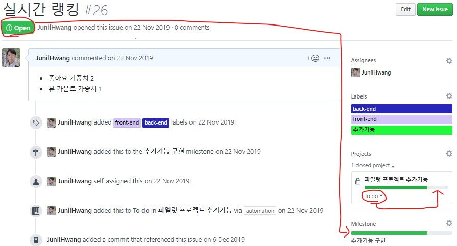
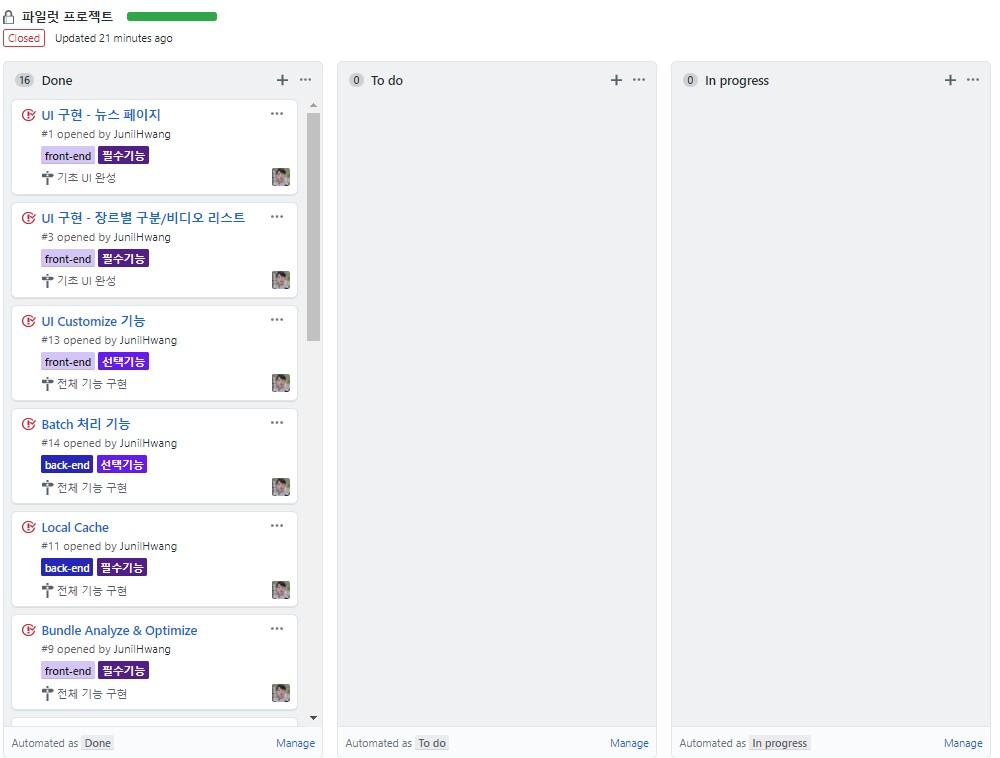

# 프로젝트 일정 관리

`GitHub`를 이용하여 프로젝트를 진행하는 동안 어떤 방식으로 일정관리를 했는지 소개합니다.

## 1. GitHub Issue 활용

각각의 `Issue`에 `Labeling`을 하여 어떤 기능들을 구현해야 되는지 쭉 작성했습니다. 

### Labeling

먼저 위와 같이 적절한 `Label`을 만들습니다.

### Milestone

GitHub Issue에는 `Milestone` 이라는 기능이 있습니다.

먼저 Milestone 목록을 만든 후

이렇게 `Milestone`와 `Issue`를 연동하면 `부분 일정`을 관리할 수 있습니다.

### Issue List

Label과 Milestone 작성 후, Issue에다가 만들어야 하는 기능을 쭉 작성했습니다.

Issue를 작성할 때, 관련 `Project`와 `Milestone`을 지정할 수 있으며 이렇게 했을 때 진행 현황을 눈으로 확인할 수 있기 때문에 매우 편리합니다.

### Commit Message로 Issue에 Commit Reference

Commit Message에 `IssueID (#Number)`를 입력하면, 해당 Issue와 Commit이 연동됩니다.

이렇게 Commit Message에 `#26`을 포함할 경우

**관련 Issue(실시간 랭킹#26)** 에 Commit이 Reference 된 것을 확인할 수 있습니다. 

## 2. Github Project 활용

`GitHub Project Tab`에서 `Project Unit`을 작성 및 관리할 수 있습니다.

`Automated`로 Project 생성 후 **Issue와 연동**하면 저절로 `To do`(해야 됨), `In Progress`(진행 중), `Done`(완료 됨) 등의 항목을 만들어줍니다.

**그리고 Issue에서 State를 변경하면 자동으로 반영됩니다**

## 사용 후기

작은 규모의 프로젝트는 이렇게 GitHub만 사용해도 충분히 효율적인 일정관리가 가능합니다.
 